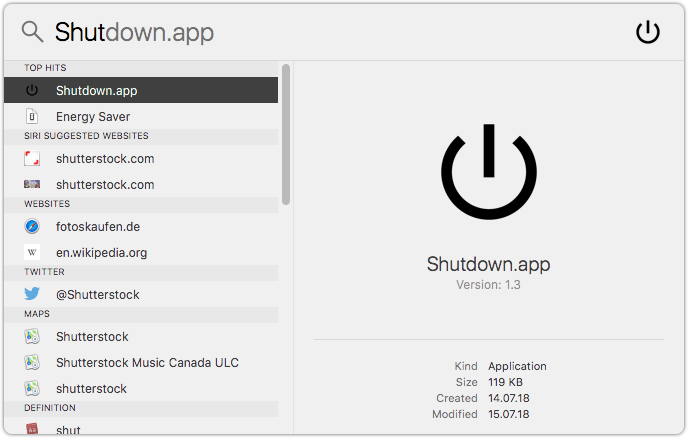

# macOS Shutdown, Restart, Sleep and Log Out App

[](https://github.com/Cyclenerd/macos-missing-shutdown-app#readme)

Four simple Apple Automator apps:

* Shutdown.app
* Restart.app
* Sleep.app
* Log Out.app

Copy these apps to your application folder. Use Spotlight Search to shut down your Mac.




## Installation

[](https://github.com/Cyclenerd/macos-missing-shutdown-app/releases/download/v1.1/Apps.zip)

Just download [`Apps.zip`](https://github.com/Cyclenerd/macos-missing-shutdown-app/releases/download/v1.1/Apps.zip) and copy the apps into your application (`~/Applications`) folder.

## Apps

### Shutdown.app

Shut down without showing a confirmation dialog.

Apple Script:
```
tell app "System Events" to shut down
```

### Restart.app

Restart without showing a confirmation dialog.

Apple Script:
```
tell app "System Events" to restart
```


### Sleep.app

Go to sleep without showing a confirmation dialog.

Apple Script:
```
tell app "System Events" to sleep
```


### Log Out.app

Log out after showing a confirmation dialog.

Apple Script:
```
tell app "System Events" to log out
```


## Icons

If you modify and save the app with Apple Automator, the icon will be reset.

You can set the icon again:

```shell
rm "~/Applications/Log Out.app/Icon"*
cp images/logout.icns "~/Applications/Log Out.app/Contents/Resources/AutomatorApplet.icns"
```

## License

[Apache License Version 2.0](https://www.apache.org/licenses/LICENSE-2.0)