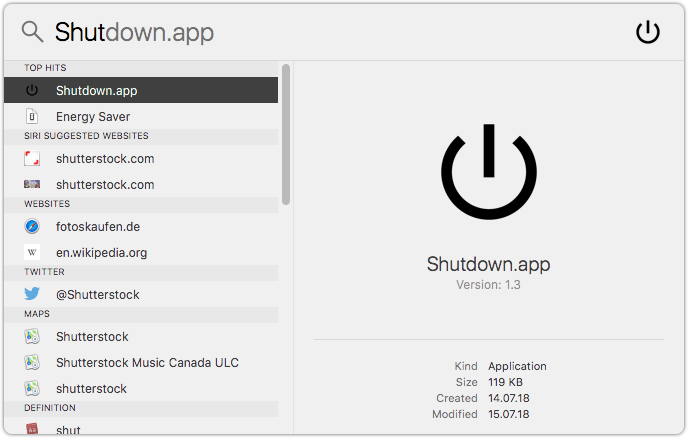

# macOS Shutdown, Restart, Sleep and Log Out App

I built four simple Apple Automator apps:

* Shutdown.app
* Restart.app
* Sleep.app
* Log Out.app

For example, if you copy these apps to your application folder, you can use Spotlight Search to shut down your Mac.




## Installation

[](https://github.com/Cyclenerd/macos-missing-shutdown-app/raw/master/Apps.zip)

Just download `Apps.zip` and copy the apps into your application (`~/Applications`) folder.

## Apps

### Shutdown.app

Shut down without showing a confirmation dialog.

Apple Script:
`tell app "System Events" to shut down`


### Restart.app

Restart without showing a confirmation dialog.

Apple Script:
`tell app "System Events" to restart`


### Sleep.app

Go to sleep without showing a confirmation dialog.

Apple Script:
`tell app "System Events" to sleep`


### Log Out.app

Log out after showing a confirmation dialog.

Apple Script:
`tell app "System Events" to log out`


## Icons

If you modify and save the app with Apple Automator, the icon will be reset.

You can set the icon again:

```
rm "~/Applications/Log Out.app/Icon"*
cp icons/logout.icns "~/Applications/Log Out.app/Contents/Resources/AutomatorApplet.icns"
```

## License

[Apache License Version 2.0](https://www.apache.org/licenses/LICENSE-2.0)