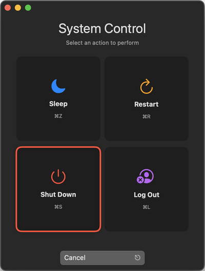

# System Control App for macOS

[](https://github.com/Cyclenerd/macos-missing-shutdown-app#readme)
[](https://github.com/Cyclenerd/macos-missing-shutdown-app#readme)
[](https://github.com/Cyclenerd/macos-missing-shutdown-app#readme)

**A simple, elegant macOS utility to control system power functions like shutdown, restart, sleep and log out with keyboard shortcuts.**



`Shutdown.app` is a lightweight utility that provides quick access to common system power functions.
With simple keyboard shortcuts and an intuitive interface, you can sleep, restart, shut down, or log out of your Mac with a single keystroke.

The app is designed to be minimal, fast, and keyboard-friendly.
It uses native macOS UI components for a seamless experience that integrates perfectly with your system.

## Features

* Sleep your Mac 😴 with <kbd>⌘</kbd> + <kbd>Z</kbd> 
* Restart your Mac with <kbd>⌘</kbd> + <kbd>R</kbd>
* Shut Down your Mac with <kbd>⌘</kbd> + <kbd>S</kbd>
* Log Out of your account with <kbd>⌘</kbd> + <kbd>L</kbd>
* Clean, native macOS interface
* Full keyboard navigation support
* Color-coded buttons for easy identification

# Requirements

* macOS 14.6 (Sonoma) or later
* 1MB of free disk space

## Installation

1. [Download](https://github.com/Cyclenerd/macos-missing-shutdown-app/releases/latest/) the latest release
1. Drag the app to your Applications folder
1. Launch the app from Launchpad or Applications folder

Tip: Use Spotlight Search and type `Shutdown` to sleep, restart, shut down, or log out of your Mac.

## Usage

1. Launch the app
1. Select an action using your mouse or keyboard (<kbd>tab</kbd>, <kbd>←</kbd>, <kbd>↑</kbd>, <kbd>→</kbd>, <kbd>↓</kbd>)
1. Press <kbd>Enter</kbd> to confirm, or use the keyboard shortcuts:
    * <kbd>⌘</kbd> + <kbd>Z</kbd> for Sleep 💤
    * <kbd>⌘</kbd> + <kbd>R</kbd> for Restart
    * <kbd>⌘</kbd> + <kbd>S</kbd> for Shut Down
    * <kbd>⌘</kbd> + <kbd>L</kbd> for Log Out
    * <kbd>Escape</kbd> to cancel

## Permissions

When first launched, the app may request accessibility permissions to control system functions.
These permissions are required for the app to function properly.

## Building from Source

**Prerequisites:**

* Xcode 16.2 or later

**Steps:**

Clone the repository:

```bash
git clone https://github.com/Cyclenerd/macos-missing-shutdown-app.git
```

Open the project in Xcode:

```bash
cd macos-missing-shutdown-app
open Shutdown.xcodeproj
```

Build the project:

Select `Product` > `Build` from the menu or use the keyboard shortcut <kbd>⌘</kbd> + <kbd>B</kbd>

Or build the project via CLI:

```bash
sudo xcode-select --switch "/Applications/Xcode.app"
xcodebuild -version
xcodebuild clean build -scheme "Shutdown" -destination "platform=macOS" CODE_SIGN_IDENTITY=""
xcodebuild archive -scheme "Shutdown" -destination "platform=macOS" -archivePath ./build/Shutdown.xcarchive CODE_SIGN_IDENTITY=""
```

## Code Structure

The app is built with SwiftUI and consists of two main files:

* `ShutdownApp.swift`: Contains the app entry point, system control logic, and models
* `ContentView.swift`: Contains the user interface implementation

## License

[Apache License Version 2.0](https://www.apache.org/licenses/LICENSE-2.0)